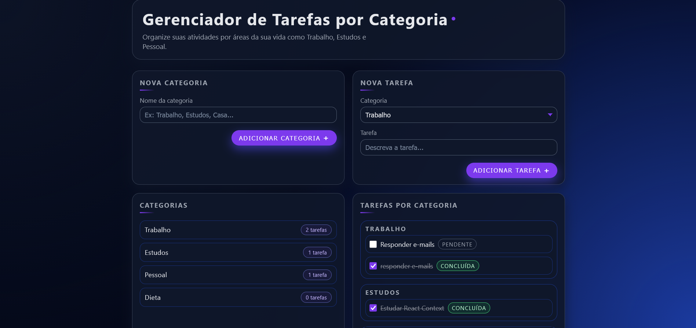

# 📌 Gerenciador de Tarefas por Categoria




Aplicação web desenvolvida em **React + Context API** para organizar tarefas de forma simples, intuitiva e totalmente categorizada.  
O usuário pode criar categorias, adicionar tarefas e marcar atividades como concluídas — tudo isso com gerenciamento global de estado via Context.

## 🚀 Tecnologias Utilizadas

- **React 18**
- **Context API**
- **Vite**
- **JavaScript (ES6+)**
- **CSS puro**

## 🎯 Funcionalidades

### ✔️ Criar Categorias  
Permite criar novas categorias personalizadas (ex.: Trabalho, Estudos, Casa).

### ✔️ Adicionar Tarefas por Categoria  
Cada tarefa sempre pertence a uma categoria específica.

### ✔️ Marcar Tarefas como Concluídas  
Com checkbox e feedback visual imediato.

### ✔️ Visualização Agrupada  
As tarefas são exibidas de forma organizada por categoria.

### ✔️ Gerenciamento Global com React Context  
Inclui:
- Lista de categorias  
- Lista de tarefas  
- Ações globais: adicionar categoria, adicionar tarefa e marcar como concluída

## 📂 Estrutura do Projeto

```
src/
 ├── components/
 │    ├── AddCategory.jsx
 │    ├── AddTask.jsx
 │    ├── CategoryList.jsx
 │    └── TaskList.jsx
 ├── context/
 │    └── TaskContext.jsx
 ├── App.jsx
 ├── main.jsx
 └── index.css
```

## 📦 Como Executar o Projeto

### 1️⃣ Instale as dependências
```bash
npm install
```

### 2️⃣ Rode o servidor de desenvolvimento
```bash
npm run dev
```

### 3️⃣ Acesse no navegador  
Normalmente disponível em:

```
http://localhost:5173
```

## 🔧 Build para Produção

```bash
npm run build
```

Arquivos otimizados serão gerados na pasta `dist/`.

## 📘 Aprendizados e Conceitos Explorados

- Uso de **Context API** para estado global  
- Composição de componentes reutilizáveis  
- Manipulação de listas e estados em React  
- Boas práticas com Vite e organização de código  


Distribuído sob a licença **MIT**.
